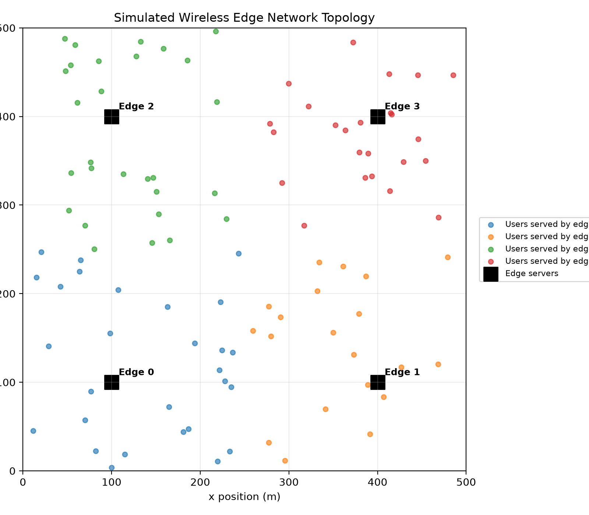
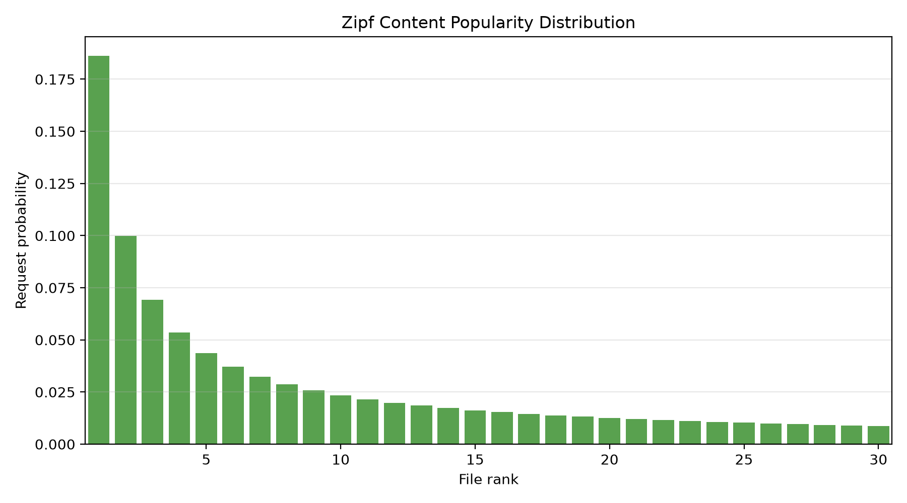
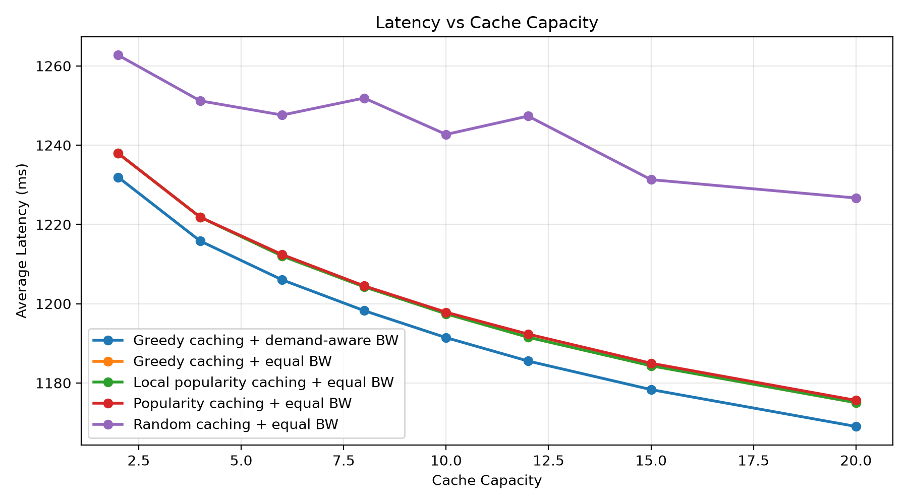
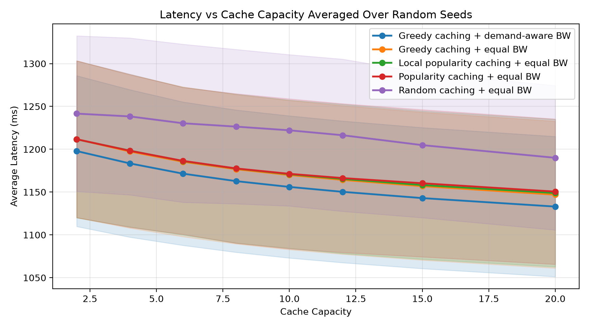

# Edge Caching and Resource Allocation for Latency Reduction in 5G/6G Wireless Networks

[](https://github.com/zhaefei/edge-caching-resource-allocation/actions/workflows/ci.yml)

This repository contains a reproducible Python simulation project for studying
edge caching and bandwidth allocation in a simplified 5G/6G wireless edge
network. The project is designed as an undergraduate-level research exploration
for graduate school application portfolios in electrical engineering,
communications, edge computing, and network optimization.

The project does not claim algorithmic novelty. Instead, it demonstrates how to
build a clear system model, implement baseline and heuristic strategies, define
meaningful metrics, run controlled experiments, and interpret results.

## Motivation

Future 5G/6G networks are expected to support data-intensive services such as
mobile video, immersive media, industrial sensing, and connected vehicles. A
major challenge is reducing content delivery latency when many users request
popular content through wireless links. Edge caching places frequently requested
content closer to users, while resource allocation controls how radio bandwidth
is shared among users.

This project asks a practical simulation question:

> How much can edge caching and simple bandwidth allocation reduce average
> content delivery latency under different cache capacities, user densities,
> and content popularity distributions?

## System Model

The simulated network contains:

- `N` content files in a library
- `M` mobile users randomly distributed in a square area
- `K` edge base stations or edge servers
- Limited cache capacity at each edge server
- Zipf-distributed content requests
- Nearest-server user association
- Wireless transmission rate based on a simplified SINR model
- Extra backhaul delay when requested content is not cached locally

The default parameters are defined in `config.py`.

## Mathematical Formulation

### Content Popularity

Content requests follow a Zipf distribution. For file `f` with rank `f = 1, ..., N`,

```math
p_f = \frac{f^{-\alpha}}{\sum_{j=1}^{N} j^{-\alpha}},
```

where `alpha` is the Zipf popularity parameter. Larger `alpha` means requests are
more concentrated on a small number of popular files.

### Cache Capacity Constraint

Let `x_{k,f}` indicate whether file `f` is cached at edge server `k`:

```math
x_{k,f} \in \{0, 1\}.
```

Each edge server can cache at most `C` files:

```math
\sum_{f=1}^{N} x_{k,f} \le C, \quad \forall k.
```

### Cache Hit Ratio

For request `i`, let `a_i` be the associated edge server and `f_i` be the
requested file. The cache hit indicator is

```math
h_i = x_{a_i,f_i}.
```

The cache hit ratio is

```math
H = \frac{1}{Q}\sum_{i=1}^{Q} h_i,
```

where `Q` is the total number of simulated requests.

### Wireless Transmission Rate

For user `u`, the downlink rate follows the Shannon capacity formula:

```math
R_u = B_u \log_2(1 + \mathrm{SINR}_u),
```

where `B_u` is the allocated bandwidth. The simplified SINR is

```math
\mathrm{SINR}_u =
\frac{P g_{u,a_u}}{\sigma^2 B_u + I_u}.
```

Here `P` is transmit power, `g_{u,a_u}` is the channel gain between user `u` and
its serving edge server, `sigma^2 B_u` is noise power, and `I_u` is a simplified
interference term.

### Latency Model

For a request by user `u`, the total latency is

```math
L_i = \frac{S}{R_u} + (1 - h_i)\left(T_{\mathrm{bh}} + \frac{S}{R_{\mathrm{bh}}}\right),
```

where `S` is file size, `T_bh` is fixed backhaul latency, and `R_bh` is backhaul
rate. If the content is cached at the edge server, the backhaul term is avoided.

### Optimization Objective

The high-level objective is to minimize average request latency:

```math
\min_x \frac{1}{Q}\sum_{i=1}^{Q} L_i
```

subject to cache capacity constraints. This project evaluates practical
heuristics rather than solving the full combinatorial optimization problem.

## Algorithms Compared

1. **Random caching + equal bandwidth**
   - Randomly selects files to cache at each edge server.
   - Splits each edge server's bandwidth equally among associated users.

2. **Popularity-based caching + equal bandwidth**
   - Caches the globally most popular files according to the Zipf distribution.
   - Uses equal bandwidth allocation.

3. **Local popularity caching + equal bandwidth**
   - Each edge server caches the files most frequently requested by its own
     associated users in the simulated trace.
   - Uses equal bandwidth allocation.

4. **Greedy latency-aware caching + equal bandwidth**
   - Iteratively chooses server-file cache placements that save the largest
     estimated backhaul latency.
   - Uses equal bandwidth allocation.

5. **Greedy caching + demand-aware bandwidth allocation**
   - Uses the same greedy caching result.
   - Allocates more bandwidth to users that generate more requests.

## Metrics

The simulator computes:

- Average latency
- Cache hit ratio
- Backhaul traffic load
- Average wireless transmission rate
- Average wireless delay
- Average backhaul delay

The experiment scripts generate:

- Wireless edge network topology visualization
- Zipf content popularity visualization
- Latency vs cache capacity
- Cache hit ratio vs cache capacity
- Multi-seed latency and cache hit ratio trends with standard deviation bands
- Latency vs number of users
- Wireless rate vs number of users
- Latency vs Zipf popularity parameter
- Cache hit ratio vs Zipf popularity parameter

## Example Figures

The figures below are example outputs generated by the simulation scripts.

**Simulated wireless edge network topology**



**Zipf content popularity distribution**



**Latency vs cache capacity**



**Multi-seed latency trend**



## Project Structure

```text
edge-caching-resource-allocation/
|-- README.md
|-- requirements.txt
|-- main.py
|-- run_all_experiments.py
|-- summarize_results.py
|-- generate_report_assets.py
|-- check_project.py
|-- config.py
|-- src/
|   |-- network.py
|   |-- request_model.py
|   |-- caching_algorithms.py
|   |-- resource_allocation.py
|   |-- metrics.py
|   |-- visualization.py
|   `-- simulation.py
|-- experiments/
|   |-- run_cache_capacity_experiment.py
|   |-- run_multi_seed_cache_capacity_experiment.py
|   |-- run_user_density_experiment.py
|   `-- run_zipf_experiment.py
|-- docs/
|   `-- figures/
|-- results/
|   |-- figures/
|   `-- data/
`-- report/
    |-- project_report_template.md
    |-- references.md
    `-- project_report_draft.md
```

## Installation

Create and activate a virtual environment:

```bash
python -m venv .venv
.venv\Scripts\activate
```

Install dependencies:

```bash
pip install -r requirements.txt
```

If your system uses the Windows Python launcher, replace `python` with `py`.

## Running the Default Simulation

```bash
python main.py
```

This generates:

- `results/data/main_summary.csv`
- `results/figures/network_topology.png`
- `results/figures/content_popularity_zipf.png`
- `results/figures/main_average_latency.png`
- `results/figures/main_cache_hit_ratio.png`
- `results/figures/main_backhaul_traffic.png`
- `results/figures/main_wireless_rate.png`

## Running Experiments

Run all experiments:

```bash
python run_all_experiments.py
```

Or run each experiment separately:

```bash
python experiments/run_cache_capacity_experiment.py
python experiments/run_multi_seed_cache_capacity_experiment.py
python experiments/run_user_density_experiment.py
python experiments/run_zipf_experiment.py
```

## Running Sanity Tests

The project includes lightweight tests based on Python's standard `unittest`
module:

```bash
python -m unittest discover -s tests
```

These checks verify basic model assumptions such as valid Zipf probabilities,
cache capacity constraints, bandwidth conservation, and reasonable metric
ranges.

For a quick project health check, run:

```bash
python check_project.py
```

This runs the sanity tests, executes the default simulation, and regenerates the
key findings summary.

## Summarizing Results

After running the simulations, generate a concise Markdown summary of the latest
CSV results:

```bash
python summarize_results.py
```

This writes:

- `results/data/key_findings.md`

To generate report-ready tables and figure references, run:

```bash
python generate_report_assets.py
```

This writes:

- `report/generated_results.md`

## Reproducing Figures

All figures are saved automatically in:

```text
results/figures/
```

All raw experiment tables are saved in:

```text
results/data/
```

Because the random seed is fixed in `config.py`, the results are reproducible
unless you change the configuration.

For a more robust view of trends, run:

```bash
python experiments/run_multi_seed_cache_capacity_experiment.py
```

This repeats the cache capacity experiment over five random seeds and saves both
raw results and mean/std summary tables. The corresponding figures include
one-standard-deviation shaded bands.

## Expected Results

Typical trends should include:

- The topology figure should show users associated with nearby edge servers.
- The content popularity figure should show the expected Zipf long-tail pattern.
- Popularity-based and greedy caching should outperform random caching.
- Local popularity caching should be competitive with global popularity caching
  when local request traces reflect the global Zipf pattern.
- Larger cache capacity should improve cache hit ratio and reduce backhaul load.
- When Zipf alpha is larger, popular files dominate requests, so caching becomes
  more effective.
- As the number of users grows, wireless bandwidth per user decreases, which can
  increase average latency.
- Demand-aware bandwidth allocation may reduce request-weighted latency when
  traffic demand is uneven across users.
- Multi-seed results should preserve the same broad trends while showing how
  much variation comes from random user placement and request traces.

With the default configuration used to generate the example figures, greedy
caching with demand-aware bandwidth allocation reduces average latency by about
4.3% relative to random caching, improves cache hit ratio by about 36.6
percentage points, and reduces backhaul traffic by about 44.8%. These values
should be interpreted as simulation results under simplified assumptions, not
as universal 5G/6G performance guarantees.

## Portfolio Relevance

This project is suitable for inclusion in a graduate school application
portfolio because it connects several important areas:

- Wireless communication system modeling
- 5G/6G edge computing
- Content caching and backhaul reduction
- Radio resource allocation
- Simulation-based performance evaluation
- Reproducible Python research workflows

It is best presented as a solid undergraduate-level research exploration rather
than as a novel optimization algorithm.

## Selected References

The report draft includes selected background references on edge caching, mobile
edge computing, Zipf-distributed requests, and wireless rate modeling. See:

- `report/references.md`

## Possible Future Improvements

- Add mobility and time-varying user association.
- Implement per-file size variation.
- Add a simple multi-armed bandit caching policy.
- Compare with convex optimization or integer programming for small networks.
- Use more realistic path-loss and fading models.
- Include energy consumption or fairness metrics.
- Validate assumptions against 3GPP-inspired parameter settings.
