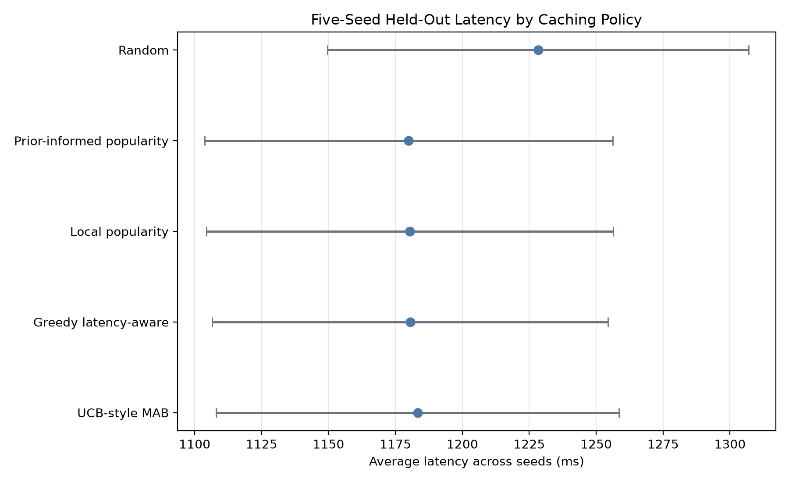
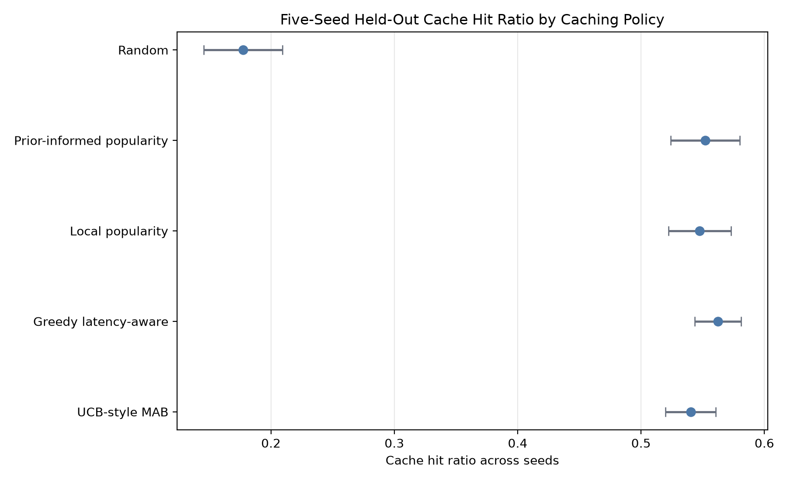
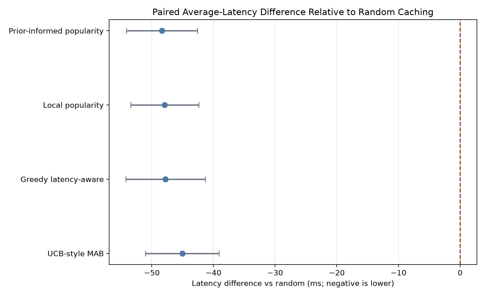
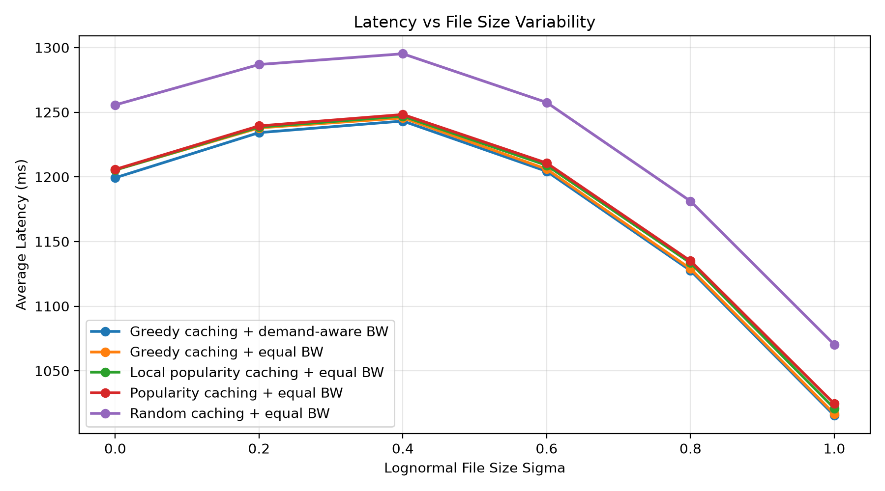
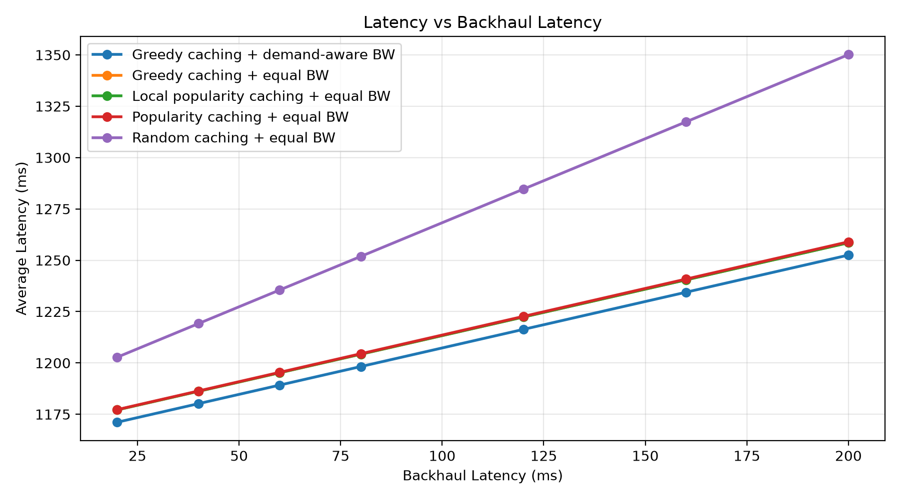
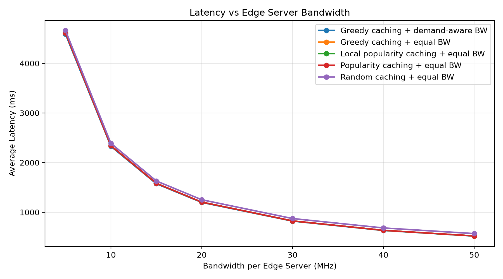
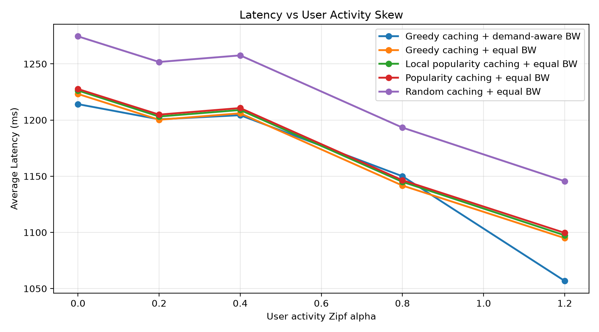
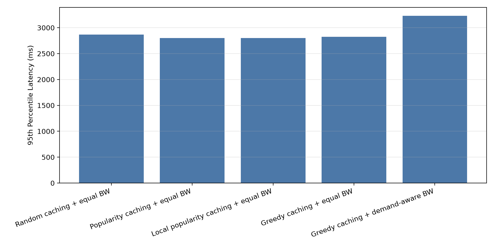
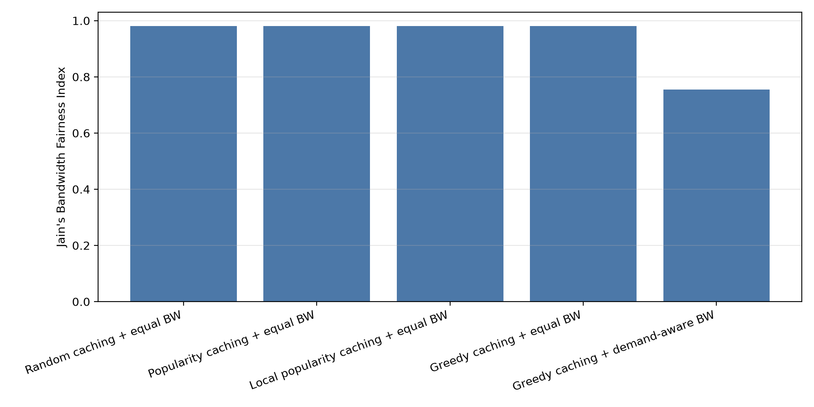
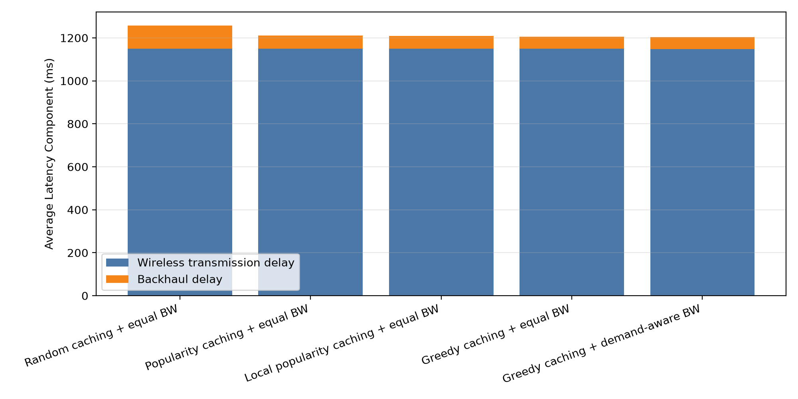

# Edge Caching and Resource Allocation for Latency Reduction in 5G/6G Wireless Networks

[](https://github.com/zhaefei/edge-caching-resource-allocation/actions/workflows/ci.yml)

**Author:** Erfei Zha

This repository contains a reproducible Python simulation project for studying
edge caching and bandwidth allocation in a simplified 5G/6G wireless edge
network. It is scoped as an undergraduate-level research exploration spanning
electrical engineering, communications, edge computing, and network
optimization.

The project does not claim algorithmic novelty. Instead, it demonstrates how to
build a clear system model, implement baseline and heuristic strategies, define
meaningful metrics, run controlled experiments, and interpret results.

## Motivation

Future 5G/6G networks are expected to support data-intensive services such as
mobile video, immersive media, industrial sensing, and connected vehicles. A
major challenge is reducing content delivery latency when many users request
popular content through wireless links. Edge caching places frequently requested
content closer to users, while resource allocation controls how radio bandwidth
is shared among users.

This project asks a practical simulation question:

> How much can edge caching and simple bandwidth allocation reduce average
> content delivery latency under different cache capacities, user densities,
> and content popularity distributions?

## System Model

The simulated network contains:

- `N` content files in a library
- `M` mobile users randomly distributed in a square area
- `K` edge base stations or edge servers
- Limited cache storage budget at each edge server
- Zipf-distributed content requests
- Bounded heterogeneous file sizes around a configurable mean
- Mild server-specific request locality around the global Zipf trend
- Nearest-server user association
- Wireless transmission rate based on a simplified SINR model
- Extra backhaul delay when requested content is not cached locally

The default parameters are defined in `config.py`.

The wireless-rate calculation now resolves through a small channel-model entry
point via `SimulationConfig.wireless_channel_model`, which keeps later channel
extensions isolated from the caching and experiment workflow. The default model
is `path_loss`, a deterministic reference-distance path-loss model using
`path_loss_reference_gain * (d_ref / distance)^path_loss_exponent`.
An optional `path_loss_fading` variant applies a clipped exponential per-link
power factor, corresponding to a lightweight Rayleigh-fading snapshot. It uses
the main simulation seed, so channel comparisons remain reproducible without
changing the caching code path.

The modeling assumptions and scope are documented in:

- `docs/model_assumptions.md`

## Mathematical Formulation

### Content Popularity

Content requests follow a Zipf distribution. For file `f` with rank `f = 1, ..., N`,

```math
p_f = \frac{f^{-\alpha}}{\sum_{j=1}^{N} j^{-\alpha}},
```

where `alpha` is the Zipf popularity parameter. Larger `alpha` means requests are
more concentrated on a small number of popular files.

To make local caching policies more meaningful, the simulator also supports a
lightweight spatial-locality model. Each edge server has a mildly boosted subset
of files, and users associated with that server draw requests from a mixture of
the global Zipf distribution and the server-specific profile.

### Cache Capacity Constraint

Let `x_{k,f}` indicate whether file `f` is cached at edge server `k`:

```math
x_{k,f} \in \{0, 1\}.
```

Each edge server has a cache storage budget `S_cache`:

```math
\sum_{f=1}^{N} x_{k,f} s_f \le S_{\mathrm{cache}}, \quad \forall k,
```

where `s_f` is the size of file `f`. The default configuration keeps
`S_cache` equal to `cache_capacity * file_size_mbits`, so `cache_capacity`
still reads naturally as the number of average-sized files an edge server can
store.

### Cache Hit Ratio

For request `i`, let `a_i` be the associated edge server and `f_i` be the
requested file. The cache hit indicator is

```math
h_i = x_{a_i,f_i}.
```

The cache hit ratio is

```math
H = \frac{1}{Q}\sum_{i=1}^{Q} h_i,
```

where `Q` is the total number of simulated requests.

### Wireless Transmission Rate

For user `u`, the downlink rate follows the Shannon capacity formula:

```math
R_u = B_u \log_2(1 + \mathrm{SINR}_u),
```

where `B_u` is the allocated bandwidth. The simplified SINR is

```math
\mathrm{SINR}_u =
\frac{P g_{u,a_u}}{\sigma^2 B_u + I_u}.
```

Here `P` is transmit power, `g_{u,a_u}` is the channel gain between user `u` and
its serving edge server, `sigma^2 B_u` is noise power, and `I_u` is a simplified
interference term.

The default path-loss channel gain between user `u` and server `k` is:

```math
g_{u,k} = g_0 \left(\frac{d_{\mathrm{ref}}}{\max(d_{u,k}, d_{\min})}\right)^\eta,
```

where `g_0` is `path_loss_reference_gain`, `d_ref` is
`path_loss_reference_distance_m`, `d_min` avoids singular behavior at very
small distances, and `eta` is the path-loss exponent.

For the optional fading snapshot, the gain becomes
`g_fading = g_path_loss * clip(X, f_min, f_max)`, where `X` follows a unit-mean
exponential distribution. This is a deliberately simple, seed-controlled
representation of Rayleigh fading power rather than a time-varying channel.

### Latency Model

For a request by user `u`, the total latency is

```math
L_i = \frac{S_{f_i}}{R_u} +
(1 - h_i)\left(T_{\mathrm{bh}} + \frac{S_{f_i}}{R_{\mathrm{bh}}}\right),
```

where `S_{f_i}` is the requested file size for request `i`, `T_bh` is fixed
backhaul latency, and `R_bh` is backhaul rate. If the content is cached at the
edge server, the backhaul term is avoided.

### Optimization Objective

The high-level objective is to minimize average request latency:

```math
\min_x \frac{1}{Q}\sum_{i=1}^{Q} L_i
```

subject to cache capacity constraints. This project evaluates practical
heuristics rather than solving the full combinatorial optimization problem.

### Lightweight MAB Cache Score

The optional learning extension treats each server-file pair as one arm. During
training epoch `e`, the observed reward for file `f` at server `k` is the
request-frequency-weighted backhaul delay that caching the file could avoid:

```math
r_{k,f,e} = \frac{n_{k,f,e}}{\max(1,n_{k,e})}
\left(T_{\mathrm{bh}} + \frac{s_f}{R_{\mathrm{bh}}}\right).
```

The UCB-style score is

```math
U_{k,f,e} = \bar{r}_{k,f} +
\beta\sqrt{\frac{\ln(e+1)}{N_{k,f}}},
```

where `N_{k,f}` is the number of observations and `beta` controls exploration.
Unseen feasible files receive exploration priority. Files are then ranked by
`U_{k,f,e} / s_f` and packed under the same cache budget. This is an
understandable adaptive baseline, not a claim of a new bandit algorithm or a
globally optimal cache placement.

## Algorithms Compared

1. **Random caching + equal bandwidth**
   - Randomly selects files until the edge cache storage budget is reached.
   - Splits each edge server's bandwidth equally among associated users.

2. **Popularity-based caching + equal bandwidth**
   - Caches globally popular files under the edge cache storage budget.
   - Uses equal bandwidth allocation.

3. **Local popularity caching + equal bandwidth**
   - Each edge server caches the files most frequently requested by its own
     associated users in the simulated trace under the storage budget.
   - Uses equal bandwidth allocation.

4. **Greedy latency-aware caching + equal bandwidth**
   - Ranks files by estimated latency reduction per cached Mbit under the local
     request trace, which makes it storage-aware when file sizes differ.
   - Uses equal bandwidth allocation.

5. **Greedy caching + demand-aware bandwidth allocation**
   - Uses the same greedy caching result.
   - Allocates more bandwidth to users that generate more requests.

### Learning-Based Extension

The simulator also implements a lightweight UCB-style MAB caching policy with
independent per-server learners, capacity-aware file packing, deterministic tie
handling, and inspectable learning diagnostics. Its design, reward definition,
and held-out evaluation protocol are documented in
[`docs/mab_caching_design.md`](docs/mab_caching_design.md). The policy is kept
out of the default five-strategy comparison to preserve the original baseline
workflow. A dedicated held-out experiment trains every request-aware policy on
the same chronological 60% prefix, evaluates all fixed caches on the same 40%
suffix, and holds bandwidth allocation equal across policies.

## Reproducible Findings

All values below are read from CSV files generated by the repository. Full
tables and interpretation notes are available in
[`results/data/key_findings.md`](results/data/key_findings.md) and
[`report/generated_results.md`](report/generated_results.md).

### Default Scenario

Under seed 42, greedy caching with demand-aware bandwidth allocation reduces
average latency by 4.2% relative to random caching, raises cache hit ratio by
41.2 percentage points, and reduces backhaul traffic by 44.7%. The associated
Jain bandwidth-fairness index changes from 0.981 to 0.755, so the average
latency result should be discussed together with its allocation tradeoff.

### Held-Out MAB Evaluation

With a common chronological 60/40 train/evaluation split and equal bandwidth,
the seed-42 MAB policy records 1234.346 ms average latency and a 0.555 hit
ratio. Random and greedy caching record 1283.899 ms and 1231.400 ms,
respectively. MAB therefore improves on random caching in this run but does not
outperform the strongest request-aware heuristic.

### Five-Seed V2 Evaluation

Across seeds 11, 22, 33, 44, and 55, MAB records `1183.254 +/- 75.278 ms`
(mean +/- sample standard deviation). Its within-seed latency difference from
random caching is `-45.051 +/- 5.966 ms`, while prior-informed popularity
caching has the lowest mean latency in this table at 1179.949 ms. Five seeds
are a lightweight robustness check; these results do not establish statistical
significance or a universal policy ranking.

## Metrics

The simulator computes:

- Average latency
- Median latency
- 95th percentile latency
- Latency standard deviation
- Cache hit ratio
- Backhaul traffic load
- Average wireless transmission rate
- Average wireless delay
- Average backhaul delay
- Average requested file size
- Jain's bandwidth fairness index
- Jain's wireless-rate fairness index

The experiment scripts generate:

- Wireless edge network topology visualization
- Zipf content popularity visualization
- Latency vs cache capacity
- Cache hit ratio vs cache capacity
- Multi-seed latency and cache hit ratio trends with standard deviation bands
- Latency vs file size variability
- Backhaul traffic vs file size variability
- Latency vs number of users
- Wireless rate vs number of users
- Latency vs user activity skew
- Bandwidth fairness vs user activity skew
- Latency vs Zipf popularity parameter
- Cache hit ratio vs Zipf popularity parameter
- Latency vs spatial locality strength
- Cache hit ratio vs spatial locality strength
- Latency vs backhaul latency
- Latency and wireless rate vs edge server bandwidth
- Latency and wireless rate vs path-loss exponent, with optional fading
- Bandwidth fairness by strategy
- Wireless/backhaul latency component breakdown
- Held-out MAB latency and cache-hit comparison
- Five-seed v2 strategy means with sample standard deviations
- Within-seed latency differences relative to random caching

## Example Figures

The figures below are example outputs generated by the simulation scripts.

**Final five-seed held-out latency comparison**



**Final five-seed held-out cache-hit comparison**



**Paired latency difference relative to random caching**



**Simulated wireless edge network topology**


**Zipf content popularity distribution**


**Latency vs cache capacity**


**Latency vs file size variability**



**Multi-seed latency trend**


**Backhaul latency sensitivity**



**Bandwidth sensitivity**



**User activity skew sensitivity**



**P95 latency by strategy**



**Bandwidth fairness by strategy**



**Latency component breakdown**



## Project Structure

```text
edge-caching-resource-allocation/
|-- README.md
|-- LICENSE
|-- requirements.txt
|-- main.py
|-- run_all_experiments.py
|-- summarize_results.py
|-- generate_report_assets.py
|-- generate_final_figures.py
|-- check_project.py
|-- config.py
|-- src/
|   |-- network.py
|   |-- request_model.py
|   |-- caching_algorithms.py
|   |-- resource_allocation.py
|   |-- wireless_channel.py
|   |-- metrics.py
|   |-- visualization.py
|   |-- reproducibility.py
|   `-- simulation.py
|-- experiments/
|   |-- run_backhaul_sensitivity_experiment.py
|   |-- run_bandwidth_sensitivity_experiment.py
|   |-- run_cache_capacity_experiment.py
|   |-- run_file_size_variability_experiment.py
|   |-- run_mab_comparison_experiment.py
|   |-- run_multi_seed_cache_capacity_experiment.py
|   |-- run_multi_seed_v2_experiment.py
|   |-- run_spatial_locality_experiment.py
|   |-- run_user_activity_experiment.py
|   |-- run_user_density_experiment.py
|   |-- run_wireless_channel_experiment.py
|   `-- run_zipf_experiment.py
|-- docs/
|   |-- experiment_plan_v2.md
|   |-- mab_caching_design.md
|   |-- model_assumptions.md
|   |-- portfolio_summary.md
|   |-- v2_roadmap.md
|   `-- figures/
|-- results/
|   |-- figures/
|   `-- data/
|       `-- key_findings.md
|-- tests/
|   `-- test_*.py
`-- report/
    |-- generated_results.md
    |-- project_report_final.md
    |-- project_report_template.md
    |-- references.md
    `-- project_report_draft.md
```

## Installation

Python 3.11 and 3.12 are tested in continuous integration.

Create and activate a virtual environment on Windows PowerShell:

```bash
python -m venv .venv
.venv\Scripts\activate
```

On macOS or Linux:

```bash
python3 -m venv .venv
source .venv/bin/activate
```

Install dependencies:

```bash
python -m pip install --upgrade pip
python -m pip install -r requirements.txt
```

On Windows, the `py` launcher can replace `python` if needed.

## Running the Default Simulation

```bash
python main.py
```

This generates:

- `results/data/main_summary.csv`
- `results/data/default_run_metadata.json`
- `results/figures/network_topology.png`
- `results/figures/content_popularity_zipf.png`
- `results/figures/main_average_latency.png`
- `results/figures/main_p95_latency.png`
- `results/figures/main_cache_hit_ratio.png`
- `results/figures/main_backhaul_traffic.png`
- `results/figures/main_wireless_rate.png`
- `results/figures/main_bandwidth_fairness.png`
- `results/figures/main_latency_breakdown.png`

## Running Experiments

Run all experiments:

```bash
python run_all_experiments.py
```

This runs the complete experiment suite, refreshes the final v2 figures and
Markdown findings, and writes `results/data/all_experiments_metadata.json`.
That metadata records the main configuration, Python version, Git commit, and
whether the working tree was dirty when the experiments were run.

Or run each experiment separately:

```bash
python experiments/run_backhaul_sensitivity_experiment.py
python experiments/run_bandwidth_sensitivity_experiment.py
python experiments/run_cache_capacity_experiment.py
python experiments/run_file_size_variability_experiment.py
python experiments/run_mab_comparison_experiment.py
python experiments/run_multi_seed_cache_capacity_experiment.py
python experiments/run_multi_seed_v2_experiment.py
python experiments/run_spatial_locality_experiment.py
python experiments/run_user_activity_experiment.py
python experiments/run_user_density_experiment.py
python experiments/run_wireless_channel_experiment.py
python experiments/run_zipf_experiment.py
```

Each experiment script also writes a matching metadata JSON file in
`results/data/` that records the run configuration, sweep parameter values, Git
commit, and generated output filenames.

The MAB comparison additionally writes `mab_comparison_diagnostics.csv`, which
records the chronological split, policy seed, epoch count, arm coverage, and
final cache utilization. The v2 multi-seed runner repeats the same held-out
protocol over five fixed seeds and saves raw results, mean and sample standard
deviation summaries, and within-seed differences relative to random caching.

## Running Sanity Tests

The project includes lightweight tests based on Python's standard `unittest`
module:

```bash
python -m unittest discover -s tests
```

These checks verify basic model assumptions such as valid Zipf probabilities,
cache capacity constraints, bandwidth conservation, and reasonable metric
ranges.

For a quick project health check, run:

```bash
python check_project.py
```

This runs the sanity tests, executes the default simulation, regenerates the
key multi-seed, spatial-locality, wireless-channel, and held-out MAB outputs,
writes key findings, and verifies that the main result files and metadata were
created.

## Summarizing Results

After running the simulations, generate a concise Markdown summary of the latest
CSV results:

```bash
python summarize_results.py
```

This writes:

- `results/data/key_findings.md`

To generate report-ready tables and figure references, run:

```bash
python generate_report_assets.py
```

This writes:

- `report/generated_results.md`

To regenerate only the three final five-seed comparison figures and key
findings from existing CSV files, run:

```bash
python generate_final_figures.py
```

This reads the saved result tables rather than rerunning the simulations.

## Reproducing Figures

All figures are saved automatically in:

```text
results/figures/
```

All raw experiment tables are saved in:

```text
results/data/
```

Because the random seed is fixed in `config.py`, the results are reproducible
unless you change the configuration. The local metadata JSON files in
`results/data/` record the simulation configuration and execution environment;
they are ignored by Git because they change on each run.

For the final held-out strategy comparison across five fixed seeds, run:

```bash
python experiments/run_multi_seed_v2_experiment.py
python generate_final_figures.py
```

The first command saves per-seed results, mean/sample-standard-deviation
summaries, paired differences relative to random caching, and MAB diagnostics.
The second command renders the final portfolio figures from those tables.

For a separate multi-seed cache-capacity sensitivity study, run:

```bash
python experiments/run_multi_seed_cache_capacity_experiment.py
```

This repeats the cache capacity experiment over five random seeds and saves both
raw results and mean/std summary tables. The corresponding figures include
one-standard-deviation shaded bands.

## Results Interpretation

The generated results support the following observations within the simulated
parameter ranges:

- The topology figure should show users associated with nearby edge servers.
- The content popularity figure should show the expected Zipf long-tail pattern.
- Informed popularity and greedy caching outperform random caching in the
  default, held-out, and five-seed comparison tables.
- Local popularity caching is competitive with global popularity caching and
  benefits when server-specific request locality is present.
- Larger cache capacity should improve cache hit ratio and reduce backhaul load.
- When file sizes become more heterogeneous, the greedy latency-aware rule can
  become more useful because it considers latency saving per cached Mbit.
- When Zipf alpha is larger, popular files dominate requests, so caching becomes
  more effective.
- When spatial locality is stronger, local popularity caching should become more
  attractive relative to one global popularity ranking.
- When backhaul latency is larger, cache misses become more expensive, so the
  relative value of edge caching should become easier to observe.
- When edge server bandwidth is larger, wireless transmission delay should
  decrease, making backhaul and caching effects easier to separate.
- The wireless channel experiment shows how path-loss exponent and a
  reproducible fading snapshot change wireless rate and end-to-end latency.
- As the number of users grows, wireless bandwidth per user decreases, which can
  increase average latency.
- Demand-aware bandwidth allocation may reduce request-weighted latency when
  traffic demand is uneven across users.
- As user activity becomes more skewed, the latency benefit of demand-aware
  bandwidth allocation should become easier to observe, but Jain's fairness
  index may decrease because bandwidth is distributed less uniformly.
- Jain's fairness index can reveal whether demand-aware allocation improves
  average latency by distributing bandwidth less uniformly.
- Multi-seed results should preserve the same broad trends while showing how
  much variation comes from random user placement and request traces.

The exact default, held-out, sensitivity, and five-seed values are generated in
`results/data/key_findings.md`. They should be interpreted as controlled
simulation evidence under the documented assumptions, not as universal 5G/6G
performance guarantees.

## Research Skills Demonstrated

The repository demonstrates work across several connected areas:

- Wireless communication system modeling
- 5G/6G edge computing
- Content caching and backhaul reduction
- Radio resource allocation
- Simulation-based performance evaluation
- Reproducible Python research workflows

The work should be interpreted as a transparent undergraduate research
simulation rather than as a novel optimization algorithm.

Project documentation:

- [Project report](report/project_report_final.md)
- [Technical portfolio summary](docs/portfolio_summary.md)
- [Generated result tables](report/generated_results.md)
- [Source-backed key findings](results/data/key_findings.md)

## Selected References

The final report uses selected background references on edge caching, mobile
edge computing, Zipf-distributed requests, and wireless rate modeling. See:

- `report/references.md`

## Possible Future Improvements

- Add mobility and time-varying user association.
- Test non-stationary demand to study when online MAB adaptation is useful.
- Compare heuristics with a small exact integer-programming benchmark on tiny
  instances, without making it a dependency of the main simulator.
- Add time-varying fading and simple channel-coherence effects.
- Include energy consumption or fairness-aware allocation objectives.
- Repeat the final comparison over more seeds and report confidence intervals.
- Validate selected assumptions against measured traces or carefully scoped
  3GPP-inspired parameter settings.

## License

This project is available under the [MIT License](LICENSE).
